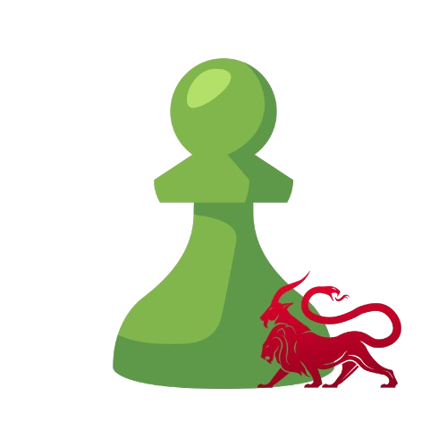

<p align="center">
  
</p>

# chesscom-c2

A [Mythic](https://github.com/its-a-feature/Mythic) C2 profile that uses **Chess.com library collections** as a covert channel - inspired by [CheckmateC2](https://github.com/OfficialScragg/CheckmateC2) (Havoc). Data is **Base5-encoded** (`PNBRQ` alphabet) and embedded into FEN positions, then stored as PGN games in Chess.com library collections.

The C2 container polls a collection for agent messages, forwards them to Mythic (`/agent_message`), and writes the response back to a second collection.

## How it works

```
Agent                     Chess.com               C2 container            Mythic
  |                           |                         |                    |
  |-- encode(payload) -> FEN -|                         |                    |
  |-- add-from-pgn ---------> |                         |                    |
  |                           |<-- list-items (poll) ---|                    |
  |                           |--- items (FEN) -------->|                    |
  |                           |                         |-- /agent_message ->|
  |                           |                         |<- response --------|
  |                           |<-- add-from-pgn --------|                    |
  |<-- list-items (poll) -----|                         |                    |
  |--- decode(FEN) -> bytes --|                         |                    |
```

Each message is prefixed with a marker FEN (`7k/8/8/8/8/8/8/7K w - - 0 1`) so the reader knows a full payload is ready. Cloudflare TLS fingerprinting is handled via `curl_cffi` with Chrome impersonation.

## Installation

```bash
./mythic-cli install github https://github.com/0xbbuddha/chesscom-c2
```

## Parameters

| Parameter | Description |
|-----------|-------------|
| `chess_com_cookie` | Full `Cookie:` header from `www.chess.com` (copy from browser DevTools) |
| `upload_token` | CSRF `_token` for `actions/add-from-pgn` |
| `clear_token` | CSRF `_token` for `actions/remove-items` |
| `agent_to_server_collection` | UUID of the collection where the **agent** writes (server reads) |
| `server_to_agent_collection` | UUID of the collection where the **server** writes (agent reads) |
| `library_referer` | Full URL of the collection page in the browser (e.g. `https://www.chess.com/analysis/collection/<slug>/games`) - required to avoid `Insufficient permissions` on the items API |
| `callback_interval` | Seconds between poll cycles |
| `callback_jitter` | Jitter percentage on interval (0-50) |
| `skip_item_ids` | Comma-separated item UUIDs to ignore (CheckmateC2 placeholders are already excluded by default) |

## Getting Chess.com credentials

1. Open your Chess.com library collection in a browser
2. Open DevTools -> Network -> filter `collections`
3. Find a `GET .../items` request that returns 200
4. Copy the full `Cookie:` header value -> `chess_com_cookie`
5. Find a `POST .../add-from-pgn` or `remove-items` request -> copy `_token` from the JSON body

> Tokens expire with the session. If the server starts logging `403` errors, refresh them.

## Configuration

Copy `C2_Profiles/chesscom/c2_code/config.json.example` to `config.json` and fill in the values, or configure directly in the Mythic UI when creating a payload.
